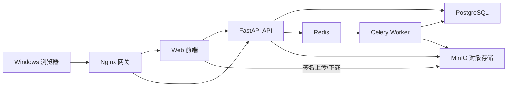
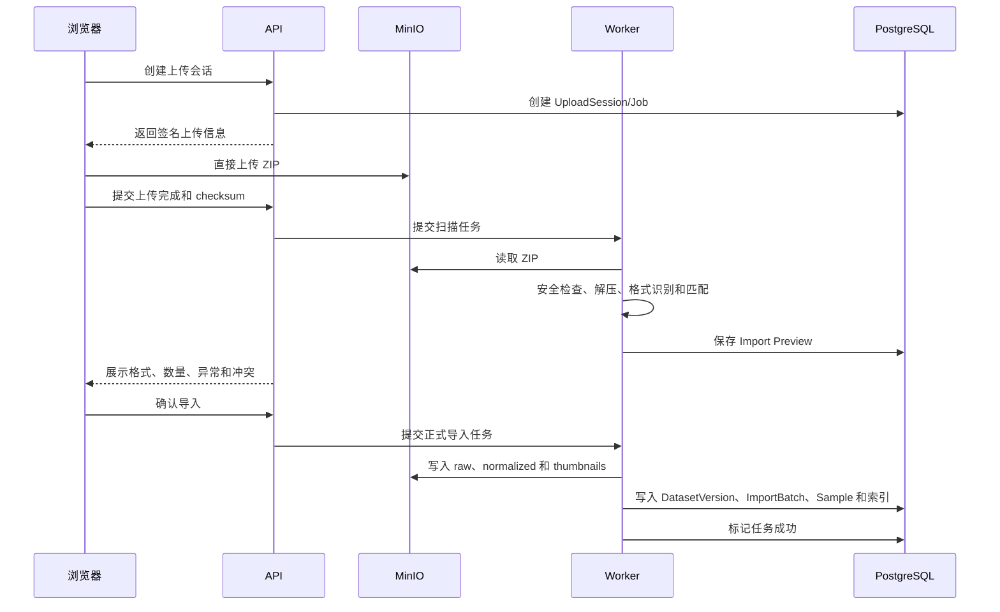
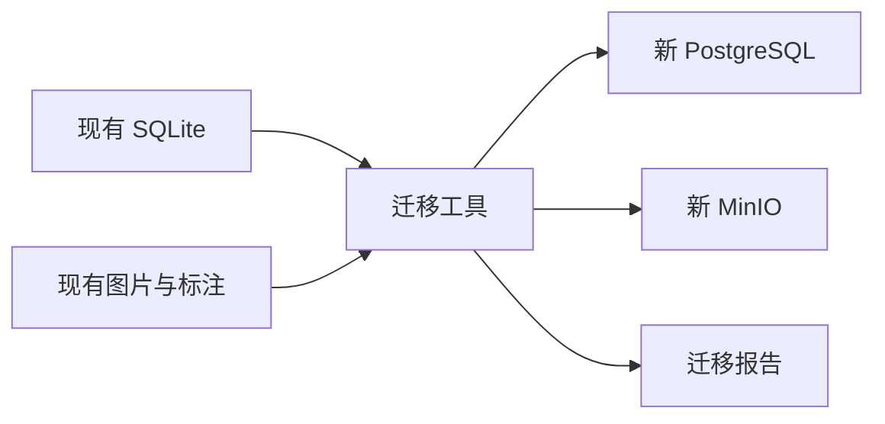

# 数据集管理平台：WSL2 本地部署与云端迁移实施方案

> 文档状态：Draft v1.0  
> 编写日期：2026-07-16  
> 目标读者：后续负责实施的 AI、开发人员、测试人员和部署人员  
> 当前阶段：只定义方案、边界、顺序和验收标准，不在本文档中实现业务代码

---

## 1. 文档目的

本文档用于指导现有本地桌面数据集管理工具，逐步建设为一个可在 Windows WSL2 中运行、后续可平滑迁移到云端的 Web 数据集管理平台。

本文档希望解决以下问题：

1. 哪些现有代码可以复用，哪些必须重构；
2. WSL2 本地环境应部署哪些组件；
3. 如何保证本地环境和未来云端环境使用同一套架构；
4. 数据、文件、任务、权限和审计应如何建模；
5. 开发应按照什么阶段推进；
6. 每个阶段的完成标准是什么；
7. 后续 AI 在实施时必须遵守哪些约束；
8. 如何把本地 PostgreSQL、MinIO 和容器服务迁移到云端。

---

## 2. 执行摘要

本项目不采用“先做一个仅适用于本地的 Web 版本，完成后再重写云端版本”的路线。

推荐路线是：

> 从第一天开始使用 PostgreSQL、对象存储、Redis、异步 Worker、容器和环境变量，在 WSL2 中模拟未来的云端运行环境。

本地与云端的核心映射如下：

| 能力 | WSL2 本地环境 | 未来云端环境 |
|---|---|---|
| Web 前端 | 前端容器或静态资源 | CDN、静态托管或前端容器 |
| API | FastAPI 容器 | 托管容器、云主机或 Kubernetes |
| 数据库 | PostgreSQL 容器 | 云 PostgreSQL |
| 对象存储 | MinIO | OSS、COS、S3 或云端 MinIO |
| 任务队列 | Redis 容器 | 云 Redis 或托管消息服务 |
| 后台任务 | Celery Worker 容器 | 可水平扩容的 Worker 容器 |
| 网关 | Nginx | 云负载均衡、API 网关或 Nginx |
| 文件访问 | MinIO 临时签名地址 | 云对象存储临时签名地址 |
| 配置 | `.env` 和本地 Secret | 云 Secret 管理和环境变量 |

新 Web 平台从一开始就必须做到：

- 不把 Windows 或 Linux 绝对路径保存为业务文件标识；
- 不使用 SQLite 作为新 Web 平台的生产数据库；
- 不让 API 服务器中转所有大文件；
- 不在 HTTP 请求中同步完成扫描、检查和导出；
- 不让业务逻辑直接依赖 MinIO、OSS 或某一家云厂商；
- 不把用户文件保存在容器临时文件系统中；
- 不把密钥、地址和密码硬编码到源码；
- 保留现有桌面程序，采用渐进式重构，避免一次性推倒重写。

---

## 3. 当前项目现状

### 3.1 当前技术栈

现有项目是本地桌面应用，主要技术为：

- Python 3；
- PySide6；
- SQLAlchemy；
- SQLite；
- Pillow；
- PyYAML；
- pytest。

主要入口和目录：

```text
C:\Users\Admin\Desktop\dataset_manger_2\src
├─ dataset_manager/
│  ├─ converters/
│  ├─ db/
│  ├─ services/
│  ├─ ui/
│  ├─ utils/
│  └─ main.py
├─ tests/
├─ README.md
└─ FEATURE_SUGGESTIONS.md
```

### 3.2 当前已经具备的业务能力

- Dataset / Part / Sample 数据组织；
- YOLO、COCO、LabelMe、Pascal VOC 导入；
- 图片和标注自动匹配；
- `train/val/test` 子集识别；
- 检测、分割、姿态关键点标注解析；
- 图片与标注预览；
- 标签和关键点名称管理；
- 质量检查；
- 数据统计；
- 多格式导出；
- Part 追加、合并、重扫和重新导入；
- 软删除、Undo/Redo/Revert；
- SQLite 数据库备份和恢复；
- 中英文和主题切换。

### 3.3 可优先复用的代码

以下目录是云端平台最有价值的基础：

```text
dataset_manager/services
dataset_manager/utils
dataset_manager/converters
```

重点可复用能力：

- 格式检测；
- 文件和标注匹配；
- 标注解析；
- 标注格式转换；
- 质量检查规则；
- 统计计算；
- 导出规则。

### 3.4 必须重构的内容

1. 数据库中的本地绝对路径；
2. SQLite 和手写 SQLite 迁移；
3. PySide6 UI；
4. QThread 桌面任务模型；
5. 直接访问 `Path`、`open`、`shutil` 的文件存储逻辑；
6. 服务层对 `dataset_manager.ui.i18n` 的依赖；
7. 全局且缺乏用户、组织作用域的 `OperationHistory`；
8. 面向单用户的权限假设；
9. 数据库备份等同于完整数据备份的假设；
10. 测试覆盖不足的问题。

### 3.5 当前测试基线

当前自动化测试数量较少，只能作为基础回归检查，不能证明完整导入、导出、安全和并发能力。

后续必须建立覆盖以下内容的测试资产：

- YOLO detection；
- YOLO segmentation；
- YOLO pose；
- COCO；
- LabelMe；
- Pascal VOC；
- 空标注和异常标注；
- 损坏图片；
- 中文和特殊字符文件名；
- 重复文件；
- 大 JSON/XML；
- 恶意压缩包；
- 多租户权限；
- Worker 重试和幂等；
- 数据库和对象存储一致性。

---

## 4. 建设目标和非目标

### 4.1 第一阶段总体目标

在 Windows WSL2 中建设一套可通过浏览器访问的本地 Web 平台，完成以下闭环：

```text
登录
→ 创建数据集
→ 上传压缩包
→ 后台扫描
→ 展示导入预览
→ 用户确认导入
→ 浏览样本
→ 查看图片和标注
→ 运行质量检查
→ 查看统计
→ 异步导出
→ 下载导出结果
```

### 4.2 第一阶段必须达到的架构目标

- 使用 PostgreSQL；
- 使用 MinIO；
- 使用 Redis；
- 使用独立后台 Worker；
- 使用 Docker Compose；
- 使用数据库迁移工具；
- API 尽量无状态；
- 文件使用 `bucket + object_key` 标识；
- 支持任务状态和进度；
- 配置与代码分离；
- 保留未来替换云服务的适配层。

### 4.3 第一阶段非目标

以下功能不应阻塞第一个 MVP：

- Kubernetes；
- 微服务拆分；
- 在线标注编辑器；
- 多人实时协同标注；
- 模型训练和推理平台；
- SSO；
- 复杂计费系统；
- 跨地域容灾；
- 数据湖和大数据计算平台；
- TB 级数据纯浏览器上传；
- 一次性重写所有桌面功能。

---

## 5. 关键假设

当前先按照以下假设设计，后续如果实际情况不同，应更新本文档：

1. 第一版主要在单台 Windows 电脑的 WSL2 中运行；
2. 第一版可能仅供本人或少量局域网用户使用；
3. 第一版以图片和标注数据集为主；
4. 第一版支持 ZIP 上传，目录上传和 CLI 上传后置；
5. 单个数据集暂按中小规模处理；
6. 现有桌面程序暂时继续保留；
7. 新 Web 平台使用独立 PostgreSQL 数据库；
8. 新 Web 平台不会直接读取用户 Windows 任意目录；
9. 后续云端可能使用阿里云 OSS、腾讯云 COS、AWS S3 或兼容对象存储；
10. 云端部署区域、云厂商和合规要求尚未最终确定。

---

## 6. WSL2 本地部署架构

### 6.1 总体架构



### 6.2 建议容器

第一阶段建议包含：

```text
nginx
frontend
api
worker
postgres
redis
minio
minio-init
```

后续可选：

```text
scheduler
flower
prometheus
grafana
loki
malware-scanner
```

### 6.3 建议端口

仅供规划，实际可通过环境变量修改：

| 服务 | 容器端口 | 宿主机暴露建议 |
|---|---:|---|
| Nginx | 80 | `127.0.0.1:8080` 或局域网端口 |
| 前端开发服务 | 3000 | 开发时可暴露，生产 Compose 不必暴露 |
| API | 8000 | 开发时可暴露，正式由 Nginx 转发 |
| PostgreSQL | 5432 | 默认只在 Docker 网络中使用 |
| Redis | 6379 | 不对局域网和公网暴露 |
| MinIO API | 9000 | 浏览器直传需要时通过受控地址暴露 |
| MinIO Console | 9001 | 仅管理员本机访问 |

生产式本地部署中，优先只对外暴露 Nginx。PostgreSQL 和 Redis 不应直接暴露给局域网。

### 6.4 WSL2 注意事项

1. Docker Desktop WSL Integration 和 WSL2 内原生 Docker Engine 二选一，避免同时运行两套 Docker Daemon；
2. 源码如果长期放在 `/mnt/c/...`，大量小文件操作可能影响开发体验；条件允许时可将 Web 平台工作目录放在 WSL2 Linux 文件系统，例如 `~/projects/dataset-platform`；
3. PostgreSQL、Redis 和 MinIO 优先使用 Docker named volume；
4. Worker 临时解压目录应使用独立 volume，并配置空间限制和清理策略；
5. 不应把数据库数据目录直接放在 Git 仓库中；
6. WSL2、Docker 和 Windows 休眠会影响长时间任务，任务系统必须支持失败重试和状态恢复；
7. 如果局域网访问，需要明确 Windows 防火墙、WSL2 端口映射和固定访问地址；
8. 如果只允许本机访问，所有宿主机端口应绑定到 `127.0.0.1`。

---

## 7. 本地与云端的可迁移设计

### 7.1 环境映射

| 抽象能力 | WSL2 实现 | 云端实现 |
|---|---|---|
| SQL 数据库 | PostgreSQL 容器 | 托管 PostgreSQL |
| 对象存储 | MinIO | OSS/COS/S3 |
| 缓存和任务队列 | Redis 容器 | 托管 Redis |
| API 计算 | Docker API 容器 | 托管容器或云主机 |
| Worker 计算 | Docker Worker 容器 | 可弹性扩容的 Worker |
| 网关 | Nginx | 负载均衡/API 网关 |
| Secret | 本地 `.env` | 云 Secret 管理 |
| 日志 | Docker 日志 | 云日志服务 |
| 监控 | 基础健康检查 | 云监控或 Prometheus |

### 7.2 必须抽象的接口

后端应定义稳定接口，业务逻辑不得直接依赖具体基础设施。

#### StorageService

职责：

- 创建上传会话；
- 生成临时上传地址；
- 完成分片上传；
- 获取对象元数据；
- 生成临时下载地址；
- 读取对象流；
- 写入对象流；
- 复制对象；
- 删除对象；
- 校验对象存在性和 checksum。

本地实现：

```text
MinIOStorageAdapter
```

未来实现：

```text
AliyunOSSStorageAdapter
TencentCOSStorageAdapter
S3StorageAdapter
```

#### Repository

建议按领域划分：

```text
DatasetRepository
SampleRepository
AssetRepository
JobRepository
AuditRepository
UserRepository
```

#### ProgressReporter

后台任务通过统一接口报告：

```text
current
total
percentage
stage
message_code
message_params
```

核心服务不应直接返回中文或英文界面文本。

---

## 8. 推荐代码组织方式

### 8.1 原则

- 保留现有 `dataset_manager` 桌面程序；
- 新 Web 平台采用新目录；
- 逐步抽离公共核心，不一次性移动全部代码；
- 桌面版和 Web 版通过公共核心共享解析、检查和转换能力；
- 不让公共核心依赖 PySide6、FastAPI、Celery、SQLAlchemy ORM 或具体对象存储 SDK。

### 8.2 推荐目标结构

```text
src/
├─ dataset_manager/                 # 现有桌面版，迁移期间保留
├─ dataset_core/                    # 逐步抽离的纯 Python 核心
│  ├─ domain/
│  ├─ parsers/
│  ├─ matching/
│  ├─ validation/
│  ├─ statistics/
│  ├─ exporters/
│  └─ errors/
├─ platform/
│  ├─ backend/
│  │  ├─ app/
│  │  │  ├─ api/
│  │  │  ├─ auth/
│  │  │  ├─ models/
│  │  │  ├─ schemas/
│  │  │  ├─ repositories/
│  │  │  ├─ services/
│  │  │  ├─ storage/
│  │  │  ├─ jobs/
│  │  │  └─ settings/
│  │  ├─ migrations/
│  │  └─ tests/
│  ├─ worker/
│  └─ frontend/
├─ deploy/
│  ├─ wsl2/
│  │  ├─ compose.yaml
│  │  ├─ nginx/
│  │  ├─ env.example
│  │  ├─ scripts/
│  │  └─ README.md
│  └─ cloud/
├─ docs/
└─ tests/
   ├─ fixtures/
   ├─ integration/
   ├─ security/
   └─ performance/
```

该结构是目标方向，不要求第一步一次性创建全部空目录。

---

## 9. 文件与对象存储设计

### 9.1 禁止保存的内容

新数据库中禁止将以下内容作为永久业务文件标识：

```text
C:\Users\Admin\...
/mnt/c/Users/Admin/...
/home/user/...
/app/tmp/...
```

### 9.2 推荐文件标识

```text
storage_provider
bucket
object_key
version_id（可选）
checksum
size_bytes
content_type
```

示例：

```text
bucket: datasets
object_key: organizations/1/datasets/100/versions/1/raw/images/train/001.jpg
```

### 9.3 推荐对象目录

```text
organizations/{organization_id}/
└─ datasets/{dataset_id}/
   └─ versions/{version_id}/
      ├─ uploads/{upload_session_id}/
      ├─ raw/
      │  ├─ images/
      │  └─ annotations/
      ├─ normalized/
      ├─ thumbnails/
      ├─ previews/
      ├─ exports/{export_job_id}/
      └─ temporary/{job_id}/
```

### 9.4 生命周期建议

- `raw`：长期保留，默认不可直接覆盖；
- `normalized`：跟随数据集版本；
- `thumbnails`：可重新生成；
- `previews`：可缓存，可过期；
- `exports`：默认设置有效期；
- `temporary`：任务结束后自动清理；
- 未完成上传：定时清理；
- 软删除数据：进入保留期，超过保留期再物理删除。

---

## 10. 目标数据模型

### 10.1 Organization

```text
id
name
status
storage_quota_bytes
created_at
updated_at
```

### 10.2 User

```text
id
email
password_hash
status
created_at
last_login_at
```

### 10.3 Membership

```text
organization_id
user_id
role
status
```

初始角色：

```text
owner
admin
editor
viewer
```

### 10.4 Dataset

```text
id
organization_id
name
description
status
created_by
created_at
updated_at
deleted_at
```

### 10.5 DatasetVersion

```text
id
dataset_id
version_number
parent_version_id
status
created_by
created_at
published_at
```

### 10.6 ImportBatch

用于承接现有 Part 概念：

```text
id
dataset_version_id
batch_number
batch_name
source_type
status
note
meta_json
created_by
created_at
deleted_at
```

### 10.7 Asset

```text
id
organization_id
storage_provider
bucket
object_key
original_name
relative_path
asset_type
content_type
size_bytes
checksum_algorithm
checksum
status
created_at
deleted_at
```

### 10.8 Sample

```text
id
dataset_version_id
import_batch_id
image_asset_id
annotation_asset_id
file_name
file_stem
relative_path
subset
annotation_type
width
height
status
created_at
deleted_at
```

建议重点索引：

```text
dataset_version_id
import_batch_id
subset
annotation_type
file_name
file_stem
status
```

唯一性不应只依赖 `file_stem`，建议结合数据集版本和相对路径。

### 10.9 AnnotationIndex

```text
sample_id
annotation_count
bbox_count
polygon_count
keypoint_count
class_ids_json
class_counts_json
normalized_annotation_asset_id
parser_name
parser_version
updated_at
```

完整标注可保存在对象存储中的规范化 JSON，数据库保存筛选和统计所需的轻量索引。

### 10.10 LabelDefinition

```text
id
dataset_version_id
class_id
class_name
color
created_at
updated_at
```

### 10.11 KeypointDefinition

```text
id
dataset_version_id
class_id
point_index
point_name
created_at
updated_at
```

### 10.12 QualityIssue

```text
id
dataset_version_id
sample_id
issue_type
severity
detail_code
detail_json
checker_version
checked_at
resolved_at
```

### 10.13 Job

```text
id
organization_id
job_type
resource_type
resource_id
status
stage
current
total
percentage
message_code
message_params_json
error_code
error_detail
attempt_count
created_by
created_at
started_at
finished_at
```

统一任务状态：

```text
pending
uploading
queued
running
waiting_confirmation
succeeded
failed
cancelled
```

### 10.14 AuditLog

```text
id
organization_id
user_id
action
resource_type
resource_id
before_json
after_json
request_id
ip_address
created_at
```

`AuditLog` 用于追踪事实，不应简单等同于可以任意 Undo 的命令历史。

---

## 11. 上传与导入流程

### 11.1 第一版上传形式

MVP 优先支持 ZIP 上传。

原因：

- 可以保留相对路径；
- 浏览器上传对象数量少；
- 导入清单更容易管理；
- 比浏览器上传数万个小文件更稳定。

后续增加：

- 浏览器目录上传；
- CLI 上传器；
- 云 Bucket 导入；
- 增量同步。

### 11.2 推荐流程



### 11.3 导入状态机

```text
created
→ uploading
→ uploaded
→ scanning
→ waiting_confirmation
→ importing
→ ready
```

失败状态：

```text
upload_failed
scan_failed
import_failed
cancelled
```

### 11.4 导入必须支持的能力

- 进度；
- 取消；
- 重试；
- 幂等；
- 超时；
- 错误报告；
- 清理临时文件；
- 防止重复提交；
- checksum 校验；
- 导入预览和正式提交分离。

---

## 12. 核心逻辑重构要求

### 12.1 公共核心不得依赖

`dataset_core` 不应依赖：

- PySide6；
- FastAPI；
- Celery；
- SQLAlchemy ORM Session；
- MinIO SDK；
- OSS/COS/S3 SDK；
- UI 国际化模块；
- Windows 绝对路径。

### 12.2 公共核心输入输出

输入应尽量是：

- 文件流；
- 临时工作目录中的受控路径；
- 标准数据类；
- manifest；
- 配置对象；
- 进度回调接口。

输出应尽量是：

- 结构化解析结果；
- 结构化问题列表；
- 结构化统计；
- 错误代码；
- 可序列化领域对象。

### 12.3 国际化处理

核心返回：

```text
message_code: import.unsupported_format
message_params: {"format": "xxx"}
```

前端负责翻译为中文或英文。

### 12.4 事务处理

底层 service 不应在每个小操作中随意 `commit`。

应由应用服务或任务边界控制事务：

```text
begin
→ 写入批次
→ 写入样本
→ 写入索引
→ 更新任务
→ commit
```

对象存储操作无法与 PostgreSQL 使用同一个事务，因此必须通过状态机、幂等键和补偿清理保证最终一致性。

---

## 13. Web 功能范围

### 13.1 P0：本地 Web MVP

- [ ] 用户登录；
- [ ] 默认组织/工作空间；
- [ ] 数据集列表；
- [ ] 创建数据集；
- [ ] ZIP 上传；
- [ ] 上传进度；
- [ ] 后台格式扫描；
- [ ] 导入预览；
- [ ] 用户确认导入；
- [ ] Dataset / ImportBatch / Sample 浏览；
- [ ] 样本服务端分页；
- [ ] 文件名、subset、标注类型、类别筛选；
- [ ] 图片和标注预览；
- [ ] 标签和关键点名称；
- [ ] 质量检查；
- [ ] 基础统计；
- [ ] 异步导出；
- [ ] 导出文件下载；
- [ ] 后台任务列表和状态；
- [ ] 软删除；
- [ ] 基础审计日志；
- [ ] PostgreSQL 备份脚本；
- [ ] MinIO 备份或同步脚本；
- [ ] WSL2 一键启动和停止说明。

### 13.2 P1：本地稳定版

- [ ] 浏览器目录上传；
- [ ] CLI 上传器；
- [ ] DatasetVersion 完整交互；
- [ ] ImportBatch 合并；
- [ ] 自定义 subset；
- [ ] 回收站；
- [ ] 任务取消、重试和失败报告；
- [ ] 重复图片检测；
- [ ] 局域网多人使用；
- [ ] RBAC 权限；
- [ ] 配额；
- [ ] 日志、指标和告警；
- [ ] 数据恢复演练。

### 13.3 P2：云端产品化

- [ ] 云对象存储适配器；
- [ ] 云 PostgreSQL；
- [ ] 云 Redis；
- [ ] HTTPS 和域名；
- [ ] SSO；
- [ ] API Token；
- [ ] 数据集分享；
- [ ] Bucket 导入；
- [ ] Webhook；
- [ ] 在线标注编辑；
- [ ] 审核和评论；
- [ ] 训练平台对接；
- [ ] 多租户计费或配额策略；
- [ ] 私有化部署支持。

---

## 14. API 模块边界

建议按资源划分 API：

```text
/auth
/organizations
/users
/datasets
/dataset-versions
/import-batches
/upload-sessions
/samples
/assets
/labels
/keypoints
/quality-checks
/statistics
/exports
/jobs
/audit-logs
```

### 14.1 API 设计要求

- 所有列表接口必须支持分页；
- 所有资源访问必须校验 organization；
- 错误返回统一结构；
- 批量操作必须设置数量上限；
- 大任务只返回 Job，不同步等待完成；
- 图片和文件返回临时访问 URL，不由 API 全量转发；
- 接口必须具备请求 ID；
- 写操作考虑幂等键；
- 删除默认软删除；
- 高风险操作必须审计。

---

## 15. 前端页面规划

### 15.1 页面列表

```text
/login
/dashboard
/datasets
/datasets/{datasetId}
/datasets/{datasetId}/versions/{versionId}
/datasets/{datasetId}/samples
/datasets/{datasetId}/quality
/datasets/{datasetId}/statistics
/datasets/{datasetId}/labels
/jobs
/audit
/settings
```

### 15.2 数据集详情布局建议

- 左侧：DatasetVersion 和 ImportBatch；
- 中间：Sample 表格；
- 右侧：图片与标注预览；
- 顶部：导入、检查、统计、导出；
- 筛选区：文件名、subset、annotation type、class、quality status；
- 底部或任务中心：后台任务进度。

### 15.3 图片预览

浏览器负责使用 Canvas 或 SVG 绘制：

- 检测框；
- 分割多边形；
- 姿态关键点；
- 类别颜色；
- 选中高亮；
- 显示/隐藏类别；
- 缩放和拖动。

服务端返回图片临时 URL 和规范化标注 JSON，不建议为每次筛选都重新生成整张叠加图片。

---

## 16. 安全要求

### 16.1 上传安全

必须实现：

- 扩展名白名单；
- MIME 和文件签名检查；
- ZIP 路径规范化；
- 禁止解压到目标目录之外；
- 限制压缩前大小；
- 限制解压后总大小；
- 限制压缩比；
- 限制文件数量；
- 限制目录深度；
- 限制文件名长度；
- 拒绝设备名和危险路径；
- XML 安全解析；
- JSON/XML 最大深度和大小；
- Worker CPU、内存、磁盘和超时限制；
- 临时目录隔离；
- 任务失败后清理。

### 16.2 权限安全

- 所有资源查询必须带组织作用域；
- 前端隐藏按钮不能代替服务端权限；
- 临时文件 URL 必须短期有效；
- 对象 key 不包含密码和敏感个人信息；
- PostgreSQL 和 Redis 不对公网暴露；
- MinIO Console 只允许管理员访问；
- Secret 不提交到 Git；
- 审计日志不得由普通用户修改。

### 16.3 本地环境安全

如果只供本机使用：

```text
端口绑定 127.0.0.1
```

如果供局域网使用：

- 使用强密码；
- 限制 Windows 防火墙来源；
- 不暴露 PostgreSQL 和 Redis；
- 建议配置内网 HTTPS；
- 明确上传配额；
- 禁止匿名访问。

---

## 17. 性能和可靠性要求

### 17.1 分页

Sample 列表不得一次加载全部数据。

建议：

```text
默认 page_size: 50
允许 page_size: 20/50/100
最大 page_size: 200
```

### 17.2 数据库批量写入

导入 Sample 时必须分批：

- 避免逐条 commit；
- 避免一次把全部 ORM 对象保存在内存；
- 保留进度更新；
- 任务重试不得重复写入。

### 17.3 Worker 隔离

后续可按任务类型拆队列：

```text
import
preview
quality
statistics
export
maintenance
```

第一版可以共用 Worker，但任务路由和配置应预留。

### 17.4 健康检查

至少提供：

- API 存活检查；
- API 就绪检查；
- PostgreSQL 检查；
- Redis 检查；
- MinIO 检查；
- Worker 心跳；
- 磁盘空间检查。

### 17.5 幂等

以下操作必须考虑幂等：

- 完成上传；
- 确认导入；
- Worker 重试；
- 导出任务；
- 删除任务；
- 清理任务；
- 数据迁移。

---

## 18. 日志、监控和审计

### 18.1 日志字段

建议所有服务输出结构化日志：

```text
timestamp
level
service
request_id
job_id
organization_id
user_id
action
duration_ms
error_code
message
```

### 18.2 不应写入日志

- 密码；
- Token；
- 对象存储 Secret；
- 完整 Cookie；
- 敏感数据内容；
- 永久签名 URL。

### 18.3 关键指标

- API 请求量和错误率；
- 请求耗时；
- Worker 队列长度；
- 任务成功率；
- 导入耗时；
- 导出耗时；
- PostgreSQL 连接数；
- Redis 状态；
- MinIO 存储量；
- 临时目录空间；
- 失败任务数量。

---

## 19. 备份与恢复

### 19.1 本地 PostgreSQL

必须提供：

- 定时逻辑备份；
- 备份保留策略；
- 恢复脚本；
- 恢复测试说明。

### 19.2 本地 MinIO

至少选择一种：

1. MinIO bucket 同步到另一块磁盘；
2. 定时复制到 NAS；
3. 定时同步到云对象存储；
4. 对关键原始数据保留外部原始副本。

### 19.3 完整恢复

完整恢复必须同时包含：

```text
PostgreSQL
MinIO 对象
环境配置
Secret 恢复流程
应用镜像或构建方式
```

只恢复 PostgreSQL 不能保证数据集文件可用。

---

## 20. 从现有桌面版迁移数据

现有 SQLite 只保存文件索引，原始图片和标注仍在用户文件系统，因此迁移不能只复制 SQLite。

后续需要单独实现迁移工具：



迁移步骤：

1. 读取 Dataset；
2. 读取 DatasetPart；
3. 读取 Sample；
4. 检查 `image_path` 和 `label_path`；
5. 计算 checksum；
6. 上传原始文件；
7. 创建 Asset；
8. 创建 DatasetVersion、ImportBatch 和 Sample；
9. 迁移标签和关键点；
10. 重新生成必要的 AnnotationIndex；
11. 输出成功、跳过、冲突和失败报告。

迁移工具必须支持：

- dry-run；
- 断点续传；
- 幂等；
- 重复文件处理；
- 缺失文件报告；
- checksum 验证；
- 中文路径；
- Windows 路径；
- 已软删除数据的选择性迁移。

---

## 21. 云端迁移流程

### 21.1 云端准备

- 创建 PostgreSQL；
- 创建 Redis；
- 创建对象存储 Bucket；
- 创建容器运行环境；
- 创建镜像仓库；
- 配置域名；
- 配置 HTTPS；
- 配置 Secret；
- 配置日志和监控；
- 配置备份和生命周期规则。

### 21.2 数据迁移

1. 在云端建立预发布环境；
2. 部署相同版本 API、Worker 和前端镜像；
3. 暂停本地写操作；
4. 备份本地 PostgreSQL；
5. 恢复至云 PostgreSQL；
6. 同步 MinIO 对象到云对象存储；
7. 比对对象数量、大小和 checksum；
8. 更新存储 provider、bucket 或必要映射；
9. 执行数据库迁移；
10. 运行数据完整性检查；
11. 完成上传、浏览、检查和导出冒烟测试；
12. 切换正式域名；
13. 保留本地只读环境一段时间；
14. 确认稳定后再决定是否下线本地环境。

### 21.3 回滚要求

云端切换前必须定义：

- 允许的停机时间；
- 回滚触发条件；
- DNS 回滚方式；
- 数据写入冻结点；
- 云端写入后如何处理回滚；
- 本地只读副本保留时间。

---

## 22. 分阶段实施计划

### Phase 0：基线和决策

目标：建立实施前的可靠基线。

任务：

- [ ] 确认 WSL2 发行版、Docker 运行方式和资源限制；
- [ ] 确认当前电脑 CPU、内存和可用磁盘；
- [ ] 统计典型数据集和最大数据集规模；
- [ ] 记录现有桌面功能清单；
- [ ] 建立格式测试夹具；
- [ ] 运行现有测试；
- [ ] 明确第一版是否仅本机使用；
- [ ] 明确第一版是否需要局域网访问；
- [ ] 确定前端技术栈；
- [ ] 确定 API、任务队列和对象存储技术栈；
- [ ] 确定目标目录结构。

验收标准：

- 所有未决策项有明确结论或默认值；
- 现有测试结果被记录；
- 测试数据集清单已建立；
- 不开始大规模代码移动。

### Phase 1：公共核心抽离

目标：让格式解析、匹配、检查和导出逻辑脱离 PySide6 和桌面文件系统假设。

任务：

- [ ] 定义公共领域数据类；
- [ ] 定义统一错误码；
- [ ] 移除核心逻辑对 UI i18n 的依赖；
- [ ] 抽离 YOLO 解析；
- [ ] 抽离 COCO 解析；
- [ ] 抽离 LabelMe 解析；
- [ ] 抽离 VOC 解析；
- [ ] 抽离质量检查；
- [ ] 抽离统计；
- [ ] 抽离导出；
- [ ] 保证桌面版主要功能不回归；
- [ ] 为每种格式增加 golden test。

验收标准：

- `dataset_core` 不导入 PySide6；
- `dataset_core` 不导入 Web 框架；
- 四类格式测试通过；
- 桌面版现有核心流程仍可运行；
- 核心逻辑错误以结构化形式返回。

### Phase 2：本地基础设施

目标：在 WSL2 中建立可重复启动的基础设施。

任务：

- [ ] Docker Compose；
- [ ] PostgreSQL；
- [ ] Redis；
- [ ] MinIO；
- [ ] MinIO bucket 初始化；
- [ ] Nginx；
- [ ] API 基础服务；
- [ ] Worker 基础服务；
- [ ] 健康检查；
- [ ] `.env.example`；
- [ ] 数据 volume；
- [ ] 启动、停止、查看日志和备份说明。

验收标准：

- 新环境可通过一组明确命令启动；
- 重启容器后数据库和对象仍存在；
- API 能检查 PostgreSQL、Redis 和 MinIO；
- Redis 和 PostgreSQL 默认不向局域网暴露；
- Secret 未提交到 Git。

### Phase 3：后端 MVP

目标：完成 Web 后端闭环。

任务：

- [ ] 用户和默认组织；
- [ ] 数据集 CRUD；
- [ ] 上传会话；
- [ ] MinIO 签名上传；
- [ ] Job 模型；
- [ ] ZIP 扫描任务；
- [ ] 导入预览；
- [ ] 确认导入；
- [ ] Sample 分页查询；
- [ ] 标签查询；
- [ ] 质量检查任务；
- [ ] 统计任务；
- [ ] 导出任务；
- [ ] 临时下载地址；
- [ ] 审计日志；
- [ ] API 集成测试。

验收标准：

- 大任务不阻塞 HTTP 请求；
- 失败任务可查看错误；
- 任务重试不会创建重复数据；
- 用户不能访问其他组织资源；
- 数据库中不出现宿主机绝对文件路径。

### Phase 4：前端 MVP

目标：完成可使用的浏览器界面。

任务：

- [ ] 登录；
- [ ] 数据集列表；
- [ ] 创建数据集；
- [ ] ZIP 上传；
- [ ] 上传进度；
- [ ] 导入预览；
- [ ] 确认导入；
- [ ] 数据集详情；
- [ ] ImportBatch 列表；
- [ ] Sample 分页表格；
- [ ] 筛选；
- [ ] 图片标注预览；
- [ ] 质量检查；
- [ ] 统计；
- [ ] 导出；
- [ ] Job 状态；
- [ ] 错误提示；
- [ ] 中英文基础支持。

验收标准：

- 浏览器可以完成完整业务闭环；
- 刷新页面后任务状态不会丢失；
- 大列表不会一次加载全部 Sample；
- 图片 URL 不是永久公开地址；
- 前端不能绕过服务端权限。

### Phase 5：生产加固

目标：达到可供真实用户稳定使用的本地版本。

任务：

- [ ] ZIP 安全处理；
- [ ] 上传限制；
- [ ] Worker 资源限制；
- [ ] 任务取消和重试；
- [ ] 定时清理；
- [ ] PostgreSQL 备份和恢复；
- [ ] MinIO 备份和恢复；
- [ ] 审计增强；
- [ ] 日志结构化；
- [ ] 指标和告警；
- [ ] 性能测试；
- [ ] 恶意输入测试；
- [ ] 数据恢复演练；
- [ ] 局域网部署说明。

验收标准：

- 已完成一次完整恢复演练；
- 恶意 ZIP 不会逃逸临时目录；
- 临时数据可自动清理；
- Worker 异常不会导致任务永久卡死；
- 关键操作可在审计日志中追踪。

### Phase 6：现有桌面数据迁移

目标：把现有 SQLite 索引和本地文件迁入新平台。

任务：

- [ ] 迁移 dry-run；
- [ ] Dataset 映射；
- [ ] Part 到 ImportBatch 映射；
- [ ] Sample 和 Asset 映射；
- [ ] 原文件上传；
- [ ] checksum；
- [ ] 标签迁移；
- [ ] 关键点迁移；
- [ ] 缺失文件报告；
- [ ] 冲突报告；
- [ ] 断点续传；
- [ ] 迁移后完整性验证。

验收标准：

- 重复执行迁移不会重复创建数据；
- 每个失败文件都有明确原因；
- 样本数量、标签数量和对象数量可核对；
- 抽样图片和标注预览正确。

### Phase 7：云端迁移

目标：将本地成熟版本部署到目标云环境。

任务：

- [ ] 云资源准备；
- [ ] 云存储适配器；
- [ ] 镜像发布；
- [ ] 云环境配置；
- [ ] 数据库迁移；
- [ ] 对象同步；
- [ ] HTTPS；
- [ ] 日志和监控；
- [ ] 备份策略；
- [ ] 安全检查；
- [ ] 压力测试；
- [ ] 切换和回滚演练。

验收标准：

- 相同应用镜像可在云端运行；
- 业务代码不因更换对象存储而大面积修改；
- 数据完整性检查通过；
- 上传、浏览、检查、统计和导出冒烟测试通过；
- 回滚流程经过验证。

---

## 23. 测试策略

### 23.1 单元测试

覆盖：

- 格式检测；
- subset 推断；
- 标注解析；
- 匹配；
- 坐标检查；
- 统计；
- 导出；
- 路径规范化；
- ZIP 条目校验；
- 权限判断；
- 状态机。

### 23.2 集成测试

使用真实 PostgreSQL、Redis 和 MinIO 测试：

- 创建上传会话；
- 上传 ZIP；
- 任务消费；
- 导入预览；
- 确认导入；
- 查询 Sample；
- 生成签名 URL；
- 质量检查；
- 导出；
- 清理。

### 23.3 端到端测试

浏览器流程：

```text
登录
→ 上传
→ 等待扫描
→ 确认导入
→ 查看样本
→ 查看标注
→ 运行质量检查
→ 导出
→ 下载
```

### 23.4 安全测试

至少包含：

- `../` ZIP 路径；
- 绝对路径 ZIP 条目；
- 超高压缩比；
- 超多小文件；
- 超深目录；
- 伪造扩展名；
- 恶意 XML；
- 超大 JSON；
- 跨组织资源 ID；
- 过期签名 URL；
- 重放确认导入请求。

### 23.5 性能测试

至少记录：

- 1,000、10,000、100,000 Sample 的分页查询；
- 大 ZIP 扫描耗时；
- 数据库批量写入耗时；
- 多个导入任务并发；
- 多个预览请求并发；
- 导出任务对其他请求的影响；
- WSL2 临时磁盘峰值。

---

## 24. 后续 AI 执行规则

后续 AI 在实施本文档时必须遵守以下规则。

### 24.1 执行顺序

1. 先检查当前仓库和 Git 状态；
2. 阅读本文档和现有 README；
3. 明确当前正在实施的 Phase；
4. 只实现当前 Phase 的最小闭环；
5. 修改前列出将影响的目录和模块；
6. 先补充或更新测试；
7. 小步修改；
8. 每一步运行对应测试；
9. 更新文档和决策记录；
10. 输出已完成、未完成、风险和下一步。

### 24.2 禁止事项

后续 AI 不得：

- 未经确认一次性删除或重写现有桌面版；
- 把 SQLite 继续作为新 Web 系统主数据库；
- 把业务文件放在 API 容器本地磁盘；
- 在数据库保存宿主机绝对路径；
- 把 MinIO/OSS Secret 写入源码；
- 把 `.env` 提交到 Git；
- 在 HTTP 请求中同步执行长时间扫描；
- 绕过统一 StorageService；
- 在核心解析模块中导入 FastAPI、Celery 或 PySide6；
- 未创建数据库迁移就直接修改生产模型；
- 未验证幂等就开启自动任务重试；
- 未设置上限就解压用户 ZIP；
- 为了让测试通过而删除有效测试；
- 未说明原因就引入 Kubernetes 或微服务；
- 未经确认执行破坏性数据迁移。

### 24.3 每次实施输出格式

后续 AI 每完成一个任务，应汇报：

```text
本次目标：
实际完成：
修改文件：
数据库迁移：
测试结果：
手工验证：
已知风险：
未完成项：
下一步建议：
```

### 24.4 决策记录

如果实施过程中改变以下内容，必须在 `docs/decisions` 增加 ADR 或更新决策记录：

- 前端框架；
- API 框架；
- 任务队列；
- 对象存储；
- 数据模型关键关系；
- DatasetVersion 策略；
- 标注完整数据存储位置；
- 鉴权方式；
- 云厂商；
- 部署方式；
- 备份策略。

---

## 25. Definition of Done

一个功能只有同时满足以下条件，才算完成：

- [ ] 业务功能可用；
- [ ] 权限校验存在；
- [ ] 输入限制存在；
- [ ] 错误结构统一；
- [ ] 关键操作有日志；
- [ ] 必要操作有审计；
- [ ] 单元测试通过；
- [ ] 集成测试通过；
- [ ] 数据库迁移可执行；
- [ ] 重复请求或任务重试不会生成重复数据；
- [ ] 不写入宿主机绝对路径；
- [ ] 不依赖容器临时文件持久化；
- [ ] 文档已更新；
- [ ] WSL2 环境可复现；
- [ ] 已说明云端替换点。

---

## 26. 建议第一轮实施任务

后续 AI 不应直接从完整 Web UI 开始。建议第一轮只完成以下内容：

1. 记录当前项目基线；
2. 确认 WSL2 和 Docker 环境；
3. 创建目标架构决策文档；
4. 建立最小 PostgreSQL、Redis、MinIO Compose；
5. 建立 API 和 Worker 健康检查；
6. 建立 StorageService 接口；
7. 建立最小 Job 状态模型；
8. 建立一套小型测试数据集夹具；
9. 抽离一个最小且低风险的格式解析模块；
10. 验证桌面版与公共核心可以并存。

第一轮结束时，不要求完成完整上传和前端，但必须证明：

```text
WSL2 Compose 可启动
API 可连接 PostgreSQL、Redis、MinIO
Worker 可接收一个测试任务
对象可写入和读取
公共核心不依赖 UI
现有桌面项目没有被破坏
```

---

## 27. 待确认问题

在正式实施前，应尽量确认：

1. 当前使用的 WSL2 Linux 发行版和版本；
2. 当前使用 Docker Desktop WSL Integration，还是 WSL2 内原生 Docker Engine；
3. 电脑 CPU、内存、磁盘和可分配给 WSL2 的资源；
4. 第一阶段是否仅本机访问；
5. 是否需要局域网多人访问；
6. 典型数据集大小；
7. 最大数据集大小；
8. 典型图片数量和最大图片数量；
9. 是否允许 ZIP 上传作为第一版入口；
10. 是否必须继续维护桌面版；
11. 目标前端框架是 React 还是 Vue；
12. 未来优先考虑哪一家云厂商；
13. 数据是否涉及隐私、工业机密或其他敏感信息；
14. 是否需要离线或私有化部署；
15. 第一版计划由一名开发者还是多人开发。

未确认时可使用本文档中的默认假设，但 AI 必须明确记录所采用的假设。

---

## 28. 推荐默认决策

如果没有额外要求，采用以下默认值：

```text
运行环境：Windows + WSL2
容器：Docker Compose
前端：React + TypeScript
API：FastAPI
ORM：SQLAlchemy 2
迁移：Alembic
数据库：PostgreSQL
对象存储：MinIO
任务：Celery + Redis
进度：SSE
网关：Nginx
认证：本地账号 + 安全 Cookie 或短期 Token
上传：ZIP 直传 MinIO
预览：Canvas/SVG + 规范化标注 JSON
文件标识：bucket + object_key
部署策略：模块化单体 API + 独立 Worker
桌面版策略：迁移期间保留
云端策略：替换托管数据库、Redis 和对象存储，不重写业务核心
```

---

## 29. 最终原则

本项目的核心目标不是单纯“把 PySide6 页面改成网页”，而是建立一套：

- 可管理大规模图片和标注；
- 可在本地运行；
- 可迁移云端；
- 可异步处理任务；
- 可审计；
- 可扩展；
- 可测试；
- 可恢复；
- 不被某一家云厂商锁死的数据集管理平台。

所有后续实现都应优先保护以下四点：

```text
数据完整性
租户与权限安全
任务幂等和可恢复
本地与云端架构一致性
```

如果某项实现只能在当前 WSL2 电脑上工作，迁移到云端需要大规模重写，则该实现不符合本文档目标。
